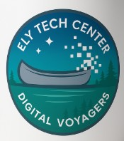

# Ely Tech Collaborative — Digital Voyagers E-Waste Initiative

## About

A youth-led e-waste collection and recycling program
serving the Ely, Minnesota area.
We make it easy for our neighbors to responsibly recycle
old electronics — keeping hazardous materials out of
our lakes and forests while learning real business
and technology skills.

## Documents

- [Business Plan](e-waste-business-plan.md) — Our working plan (help us fill it in!)
- [Glossary](GLOSSARY.md) — Key terms and acronyms

## Getting Started

1. Read the [Business Plan](e-waste-business-plan.md)
2. Pick a section with ❓ marks or unchecked boxes
3. Research the answers
4. Submit a pull request with your updates

## Tools

This repo recommends VS Code extensions for spell checking,
markdown formatting, and editor consistency.
They are only needed when working on the repo on a local machine.
When all edits are made in the browser,

## License

This work is licensed under a
[Creative Commons Attribution 4.0 International License](https://creativecommons.org/licenses/by/4.0/).
